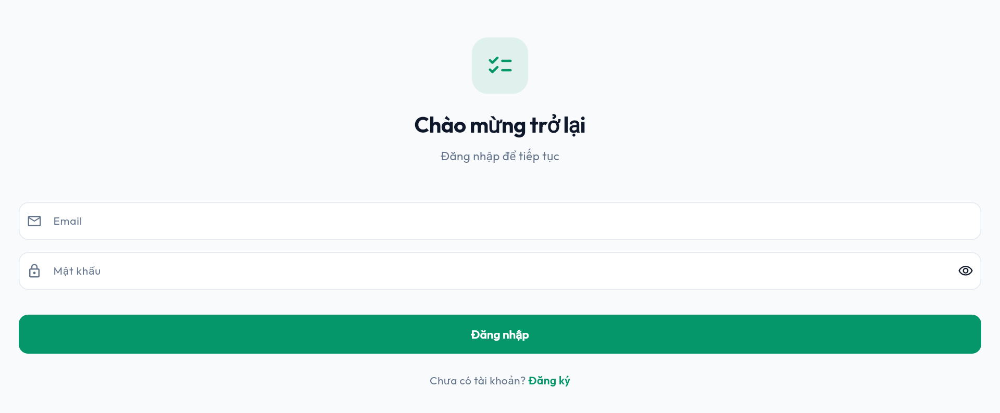

# Hướng dẫn cài đặt và sử dụng TaskFlow

## Ứng dụng Todo App với Flutter + Supabase

---

## Mục lục

1. [Giới thiệu](#1-giới-thiệu)
2. [Yêu cầu hệ thống](#2-yêu-cầu-hệ-thống)
3. [Cài đặt môi trường](#3-cài-đặt-môi-trường)
4. [Tạo Supabase Project](#4-tạo-supabase-project)
5. [Cấu hình dự án Flutter](#5-cấu-hình-dự-án-flutter)
6. [Chạy ứng dụng](#6-chạy-ứng-dụng)
7. [Cấu trúc mã nguồn](#7-cấu-trúc-mã-nguồn)
8. [Hướng dẫn sử dụng](#8-hướng-dẫn-sử-dụng)
9. [Kiến trúc hệ thống](#9-kiến-trúc-hệ-thống)
10. [Xử lý lỗi thường gặp](#10-xử-lý-lỗi-thường-gặp)

---

## 1. Giới thiệu

**TaskFlow** là ứng dụng quản lý công việc (Todo App) được xây dựng bằng **Flutter** (Frontend) kết hợp với **Supabase** (Backend - PostgreSQL + Authentication).

### Tính năng chính

- ✅ Đăng ký / đăng nhập bằng email
- ✅ Quản lý danh mục công việc (thêm, sửa, xóa) — có màu sắc và icon
- ✅ Quản lý công việc (thêm, sửa, xóa) — với tiêu đề, mô tả, độ ưu tiên, hạn chót
- ✅ Lọc công việc theo trạng thái, danh mục, độ ưu tiên
- ✅ Đánh dấu hoàn thành / chưa hoàn thành
- ✅ Floating snackbar thông báo cho mọi thao tác

### Công nghệ sử dụng

| Công nghệ | Phiên bản | Mục đích |
|-----------|-----------|----------|
| Flutter | 3.41.9 | Framework đa nền tảng |
| Dart | 3.11.5 | Ngôn ngữ lập trình |
| Supabase | 2.14.2 | Backend-as-a-Service (PostgreSQL + Auth) |
| Provider | 6.1.2 | State management |
| Google Fonts | 8.1.0 | Font Outfit |

---

## 2. Yêu cầu hệ thống

Trước khi bắt đầu, bạn cần cài đặt các công cụ sau:

### 2.1. Flutter SDK

Tải và cài đặt Flutter SDK từ trang chủ: [https://docs.flutter.dev/get-started/install](https://docs.flutter.dev/get-started/install)

Sau khi cài đặt, mở Terminal (Command Prompt hoặc PowerShell) và kiểm tra:

```bash
flutter --version
```

Kết quả mong đợi:

```
Flutter 3.41.9 • channel stable • https://github.com/flutter/flutter.git
Dart 3.11.5
```

### 2.2. Git

Tải và cài đặt Git: [https://git-scm.com/downloads](https://git-scm.com/downloads)

Kiểm tra:

```bash
git --version
```

### 2.3. Trình soạn thảo code

Khuyến nghị sử dụng **Visual Studio Code** với các extension:
- **Flutter** (Dart Code)
- **Supabase**

### 2.4. Tài khoản Supabase

Đăng ký tài khoản miễn phí tại: [https://supabase.com](https://supabase.com)

---

## 3. Cài đặt môi trường

### 3.1. Kiểm tra Flutter

Mở Terminal và chạy lệnh kiểm tra:

```bash
flutter doctor
```

Kết quả mong đợi (tất cả đều có dấu ✅):

```
Doctor summary (to see all details, run flutter doctor -v):
[✓] Flutter (Channel stable, 3.41.9)
[✓] Windows Version (Installed version)
[✓] Android toolchain
[✓] Visual Studio
[✓] Chrome (for web)
[✓] Android Studio
[✓] VS Code
[✓] Connected device (2 available)
```

Nếu có dấu ❙ hoặc ❌, hãy làm theo hướng dẫn của Flutter để cài đặt các thành phần còn thiếu.

### 3.2. Clone dự án từ GitHub

Mở Terminal và chạy:

```bash
git clone https://github.com/LukasDanga/PRM393_miniProject2.git
cd PRM393_miniProject2
```

---

## 4. Tạo Supabase Project

### Bước 1: Đăng nhập Supabase

Truy cập [https://supabase.com/dashboard](https://supabase.com/dashboard) và đăng nhập.

### Bước 2: Tạo project mới

Nhấn nút **"New project"**.


Điền thông tin:
- **Name:** `todo-app` (hoặc tên tùy ý)
- **Database Password:** Nhập mật khẩu (ghi nhớ để sau này)
- **Region:** Chọn `Singapore` (gần Việt Nam nhất)
- **Pricing Plan:** Chọn **Free**

Nhấn **"Create new project"** và đợi khoảng 2 phút.

### Bước 3: Lấy thông tin kết nối

Sau khi project được tạo, vào **Settings → API** (hoặc **Project Settings > API**).

Copy 2 giá trị sau:
- **Project URL** (ví dụ: `https://hlwebzrcfuocpdplpcrm.supabase.co`)
- **anon public key** (dài, bắt đầu bằng `eyJ...`)


### Bước 4: Tạo các bảng dữ liệu

Vào **SQL Editor**, nhấn **"New query"**, paste nội dung sau và nhấn **Run**:

```sql
-- Tạo bảng profiles
CREATE TABLE profiles (
  id UUID PRIMARY KEY REFERENCES auth.users ON DELETE CASCADE,
  email TEXT NOT NULL,
  full_name TEXT,
  avatar_url TEXT,
  created_at TIMESTAMPTZ DEFAULT NOW()
);

-- Tạo bảng categories
CREATE TABLE categories (
  id UUID PRIMARY KEY DEFAULT gen_random_uuid(),
  user_id UUID NOT NULL REFERENCES profiles(id) ON DELETE CASCADE,
  name TEXT NOT NULL,
  color TEXT NOT NULL,
  icon TEXT NOT NULL,
  created_at TIMESTAMPTZ DEFAULT NOW()
);

-- Tạo bảng tasks
CREATE TABLE tasks (
  id UUID PRIMARY KEY DEFAULT gen_random_uuid(),
  user_id UUID NOT NULL REFERENCES profiles(id) ON DELETE CASCADE,
  category_id UUID REFERENCES categories(id) ON DELETE SET NULL,
  title TEXT NOT NULL,
  description TEXT,
  is_completed BOOLEAN DEFAULT FALSE,
  priority INTEGER DEFAULT 2,
  due_date TIMESTAMPTZ,
  created_at TIMESTAMPTZ DEFAULT NOW(),
  updated_at TIMESTAMPTZ DEFAULT NOW()
);

-- Tạo trigger: tự động tạo profile khi có user mới
CREATE OR REPLACE FUNCTION handle_new_user()
RETURNS TRIGGER AS $$
BEGIN
  INSERT INTO profiles (id, email, full_name)
  VALUES (
    NEW.id,
    NEW.email,
    NEW.raw_user_meta_data->>'full_name'
  );
  RETURN NEW;
END;
$$ LANGUAGE plpgsql SECURITY DEFINER;

CREATE TRIGGER on_auth_user_created
  AFTER INSERT ON auth.users
  FOR EACH ROW
  EXECUTE FUNCTION handle_new_user();
```


### Bước 5: Thiết lập Row Level Security (RLS)

Vào **Authentication → Policies**, từng bảng:

**profiles:**
```sql
CREATE POLICY "Users can view own profile"
  ON profiles FOR SELECT
  USING (auth.uid() = id);

CREATE POLICY "Users can update own profile"
  ON profiles FOR UPDATE
  USING (auth.uid() = id);
```

**categories:**
```sql
CREATE POLICY "Users can view own categories"
  ON categories FOR SELECT
  USING (auth.uid() = user_id);

CREATE POLICY "Users can insert own categories"
  ON categories FOR INSERT
  WITH CHECK (auth.uid() = user_id);

CREATE POLICY "Users can update own categories"
  ON categories FOR UPDATE
  USING (auth.uid() = user_id);

CREATE POLICY "Users can delete own categories"
  ON categories FOR DELETE
  USING (auth.uid() = user_id);
```

**tasks:**
```sql
CREATE POLICY "Users can view own tasks"
  ON tasks FOR SELECT
  USING (auth.uid() = user_id);

CREATE POLICY "Users can insert own tasks"
  ON tasks FOR INSERT
  WITH CHECK (auth.uid() = user_id);

CREATE POLICY "Users can update own tasks"
  ON tasks FOR UPDATE
  USING (auth.uid() = user_id);

CREATE POLICY "Users can delete own tasks"
  ON tasks FOR DELETE
  USING (auth.uid() = user_id);
```

### Bước 6: Tắt xác nhận email (quan trọng)

Vào **Authentication → Settings**, tìm mục **"Confirm email"** và **TẮT** nó đi.


> **Lưu ý:** Nếu không tắt, bạn sẽ không thể đăng nhập sau khi đăng ký vì email xác nhận sẽ không được gửi.

---

## 5. Cấu hình dự án Flutter

### Bước 1: Tạo file .env

Trong thư mục dự án, tạo file `.env` với nội dung:

```
SUPABASE_URL=https://hlwebzrcfuocpdplpcrm.supabase.co
SUPABASE_ANON_KEY=eyJhbGciOiJIUzI1NiIsInR5cCI6IkpXVCJ9...
```

Thay thế `SUPABASE_URL` và `SUPABASE_ANON_KEY` bằng thông tin bạn đã copy ở Bước 3.

> **Chú ý:** File `.env` đã được khai báo trong `.gitignore` nên sẽ không bị đẩy lên GitHub.

### Bước 2: Cài đặt dependencies

Chạy lệnh:

```bash
flutter pub get
```

Kết quả mong đợi:

```
Resolving dependencies...
Downloading packages...
Changed 2 dependencies!
```

### Bước 3: Kiểm tra không có lỗi

```bash
flutter analyze
```

Kết quả mong đợi không có **error** hay **warning** (chỉ có info):

```
No issues found!
```

---

## 6. Chạy ứng dụng

### Chạy trên Web (dễ nhất)

```bash
flutter run -d chrome
```

Đợi Flutter compile (lần đầu có thể mất 1-2 phút). Trình duyệt Chrome sẽ tự động mở với ứng dụng.

### Chạy trên Windows

```bash
flutter run -d windows
```

### Chạy trên Android (cần máy ảo hoặc điện thoại)

```bash
flutter run
```

(Lệnh này sẽ tự động chọn thiết bị khả dụng. Nếu có nhiều thiết bị, dùng `flutter devices` để xem danh sách và chọn bằng `-d <device-id>`.)

---

## 7. Cấu trúc mã nguồn

```
mini-project2/
├── lib/
│   ├── main.dart                          # Entry point, khởi tạo Supabase + Provider
│   ├── theme.dart                         # Material 3 theme (màu emerald, font Outfit)
│   ├── models/
│   │   ├── user_model.dart                # User: id, email, full_name, avatar_url
│   │   ├── task_model.dart                # Task: title, description, priority, due_date,...
│   │   └── category_model.dart            # Category: name, color (hex), icon (text)
│   ├── services/
│   │   ├── auth_service.dart              # Auth: signUp, signIn, signOut, updateProfile
│   │   └── database_service.dart          # CRUD: tasks & categories với Supabase API
│   ├── screens/
│   │   ├── splash_screen.dart             # Splash animation → kiểm tra auth → chuyển hướng
│   │   ├── login_screen.dart              # Màn hình đăng nhập
│   │   ├── register_screen.dart           # Màn hình đăng ký
│   │   ├── home_screen.dart               # Trang chủ: danh sách task + filter
│   │   ├── category_screen.dart           # Quản lý danh mục (thêm/sửa/xóa)
│   │   ├── add_edit_task_screen.dart      # Thêm / sửa task
│   │   └── profile_screen.dart            # Hồ sơ người dùng + đăng xuất
│   └── widgets/
│       └── icon_mapping.dart              # Map tên icon (string) → Flutter IconData
├── docs/
│   └── screenshots/                       # Hình ảnh minh họa
├── .env                                   # Biến môi trường (SUPABASE_URL, SUPABASE_ANON_KEY)
├── pubspec.yaml                           # Cấu hình dependencies
└── README.md                              # Giới thiệu dự án
```

### Giải thích từng thành phần

#### `main.dart` — Điểm vào của ứng dụng

```dart
void main() async {
  WidgetsFlutterBinding.ensureInitialized();
  await dotenv.load();  // Đọc SUPABASE_URL, SUPABASE_ANON_KEY từ .env

  await Supabase.initialize(
    url: dotenv.env['SUPABASE_URL'] ?? '',
    publishableKey: dotenv.env['SUPABASE_ANON_KEY'] ?? '',
  );

  runApp(const MyApp());
}
```

- **Dòng 10-12:** Load file `.env`
- **Dòng 14-17:** Khởi tạo Supabase với URL và Anon Key
- **Dòng 27-30:** Cung cấp `AuthService` và `DatabaseService` cho toàn bộ ứng dụng qua `MultiProvider`

#### `theme.dart` — Giao diện Material 3

Tập trung toàn bộ theme:
- Màu chủ đạo: Emerald (`#059669`)
- Font: Outfit (Google Fonts)
- Bo góc: Card 16px, Input 12px, Button 12px
- Bottom sheet bo góc 24px trên

#### Models

Mỗi model có:
- **Constructor** với tất cả thuộc tính
- **`fromJson()`** — chuyển từ JSON (Supabase response) sang Dart object
- **`toJson()`** — chuyển từ Dart object sang JSON (Supabase request)

Ví dụ `task_model.dart`:
```dart
class TaskModel {
  final String id;
  final String userId;
  final String? categoryId;
  final String title;
  final String? description;
  final bool isCompleted;
  final int priority;        // 1=Thấp, 2=TB, 3=Cao
  final DateTime? dueDate;
  final DateTime? createdAt;
  final DateTime? updatedAt;
  final CategoryModel? category;  // Join từ bảng categories

  // fromJson / toJson / copyWith / priorityLabel
}
```

#### Services — Nơi gọi API Supabase

**`auth_service.dart`** — Xác thực
- `signUp(email, password, fullName)` → gọi `_supabase.auth.signUp()`
- `signIn(email, password)` → gọi `_supabase.auth.signInWithPassword()`
- `signOut()` → gọi `_supabase.auth.signOut()`
- `updateProfile(fullName, avatarUrl)` → UPDATE bảng `profiles`

**`database_service.dart`** — CRUD
- `fetchCategories(userId)` → `SELECT * FROM categories WHERE user_id = $userId`
- `addCategory(category)` → `INSERT INTO categories ...`
- `updateCategory(category)` → `UPDATE categories SET ... WHERE id = $id`
- `deleteCategory(id)` → `DELETE FROM categories WHERE id = $id`
- `fetchTasks(userId)` → `SELECT *, categories(*) FROM tasks WHERE user_id = $userId`
- `addTask(task)` → `INSERT INTO tasks ... RETURNING *, categories(*)`
- `updateTask(task)` → `UPDATE tasks SET ... WHERE id = $id`
- `toggleTask(id, isCompleted)` → `UPDATE tasks SET is_completed = $val`
- `deleteTask(id)` → `DELETE FROM tasks WHERE id = $id`

#### Screens — Giao diện người dùng

Mỗi screen là một `StatefulWidget` dùng `context.watch<T>()` để lắng nghe state và `context.read<T>()` để gọi action.

---

## 8. Hướng dẫn sử dụng

### 8.1. Màn hình Splash

Khi mở ứng dụng, bạn sẽ thấy màn hình Splash với animation fade-in + slide-up.



Sau 2.2 giây, ứng dụng sẽ tự động:
- **Chuyển đến HomeScreen** nếu đã đăng nhập (có session)
- **Chuyển đến LoginScreen** nếu chưa đăng nhập

### 8.2. Đăng ký tài khoản


1. Nhập **Email**
2. Nhập **Mật khẩu** (tối thiểu 6 ký tự)
3. Nhập **Họ tên** (tùy chọn)
4. Nhấn **"Đăng ký"**

> **Lưu ý:** Nếu gặp lỗi `429 Too Many Requests`, hãy đợi 5-10 phút và thử lại. Đây là giới hạn từ Supabase.

### 8.3. Đăng nhập


1. Nhập **Email** đã đăng ký
2. Nhập **Mật khẩu**
3. Nhấn **"Đăng nhập"**

Nếu chưa có tài khoản, nhấn **"Chưa có tài khoản? Đăng ký"** để chuyển sang màn hình đăng ký.

### 8.4. Trang chủ — Danh sách công việc


Trang chủ hiển thị:
1. **Thanh tiêu đề:** Icon danh mục (trái) và icon người dùng (phải)
2. **Bộ lọc nhanh:** Chip "Tất cả" / "Hôm nay" và nút "Lọc" (phải)
3. **Danh sách task:** Mỗi task có checkbox, tiêu đề, ưu tiên, hạn chót, danh mục
4. **FAB (nút +):** Thêm task mới

#### Lọc công việc

Nhấn nút **"Lọc"** để mở bottom sheet:


- **Trạng thái:** Chưa xong / Đã xong
- **Danh mục:** Chọn từng danh mục
- **Ưu tiên:** Thấp / Trung bình / Cao

Nhấn **"Áp dụng bộ lọc"** để lọc, hoặc **"Bỏ lọc"** để reset.

#### Đánh dấu hoàn thành

Nhấn vào checkbox bên cạnh task để đánh dấu hoàn thành / chưa hoàn thành. Có animation gạch ngang chữ.

### 8.5. Thêm / Sửa công việc


1. Nhập **Tiêu đề** (bắt buộc)
2. Nhập **Mô tả** (tùy chọn)
3. Chọn **Danh mục** (nếu có)
4. Chọn **Ưu tiên** (chip: Thấp / TB / Cao)
5. Chọn **Hạn chót** (nhấn vào ô ngày để mở DatePicker)
6. Nhấn **"Lưu"**

### 8.6. Quản lý danh mục


Nhấn icon **hình lưới (grid)** trên thanh tiêu đề để vào quản lý danh mục.

- **Thêm:** Nhấn nút **"+"** ở cuối danh sách → nhập tên → chọn màu → chọn icon → Lưu
- **Sửa:** Nhấn vào danh mục → chỉnh sửa → Lưu
- **Xóa:** Nhấn vào danh mục → nút "Xóa" → xác nhận

> **Lưu ý:** Khi xóa danh mục, các task trong danh mục đó sẽ được giữ nguyên nhưng `category_id` sẽ được set thành `null` (bỏ trống danh mục).


### 8.7. Hồ sơ người dùng


Nhấn icon **người dùng** trên thanh tiêu đề để vào hồ sơ.

- Xem thông tin: Email, Họ tên
- Chỉnh sửa họ tên
- Đăng xuất

---

## 9. Kiến trúc hệ thống

### 9.1. Mô hình 3 lớp

```
┌──────────────────────────────────────────────┐
│              SCREENS (Giao diện)              │
│  splash | login | register | home | category  │
│  add_edit_task | profile                      │
├──────────────────────────────────────────────┤
│            SERVICES (Business Logic)          │
│  auth_service.dart   database_service.dart    │
│  (ChangeNotifier — quản lý state + gọi API)   │
├──────────────────────────────────────────────┤
│             MODELS (Dữ liệu)                  │
│  user_model.dart   task_model.dart            │
│  category_model.dart                          │
└──────────────────────────────────────────────┘
         │                    │
         ▼                    ▼
   ┌─────────────────────────────┐
   │        SUPABASE API         │
   │  (PostgreSQL + Auth)        │
   └─────────────────────────────┘
```

### 9.2. Luồng dữ liệu

1. **Người dùng thao tác** trên Screen (ví dụ: nhấn "Thêm task")
2. **Screen gọi method** trên Service: `context.read<DatabaseService>().addTask(task)`
3. **Service gọi API** Supabase: `_supabase.from('tasks').insert(task.toJson()).select().single()`
4. **Supabase trả JSON** về Service
5. **Service parse JSON** thành Model và cập nhật local state
6. **Service gọi `notifyListeners()`** → UI tự động rebuild

### 9.3. State Management với Provider

```dart
// Cung cấp services ở root
MultiProvider(
  providers: [
    ChangeNotifierProvider(create: (_) => AuthService()),
    ChangeNotifierProvider(create: (_) => DatabaseService()),
  ],
  child: MaterialApp(...)
)

// Screen lắng nghe state
final tasks = context.watch<DatabaseService>().tasks;
// → Tự động rebuild khi tasks thay đổi

// Screen gọi action
context.read<DatabaseService>().addTask(newTask);
```

### 9.4. Database Schema


**Bảng `profiles`:**

| Cột | Kiểu | Ghi chú |
|-----|------|---------|
| `id` | `uuid` | Khóa chính, FK → `auth.users` |
| `email` | `text` | |
| `full_name` | `text?` | |
| `avatar_url` | `text?` | |
| `created_at` | `timestamptz` | Mặc định `now()` |

**Bảng `categories`:**

| Cột | Kiểu | Ghi chú |
|-----|------|---------|
| `id` | `uuid` | Khóa chính, tự động sinh |
| `user_id` | `uuid` | FK → `profiles.id` |
| `name` | `text` | Tên danh mục |
| `color` | `text` | Mã hex `#RRGGBB` |
| `icon` | `text` | Tên icon (vd: `"work"`, `"folder"`) |
| `created_at` | `timestamptz` | Mặc định `now()` |

**Bảng `tasks`:**

| Cột | Kiểu | Ghi chú |
|-----|------|---------|
| `id` | `uuid` | Khóa chính, tự động sinh |
| `user_id` | `uuid` | FK → `profiles.id` |
| `category_id` | `uuid?` | FK → `categories.id`, có thể null |
| `title` | `text` | Tiêu đề |
| `description` | `text?` | Mô tả |
| `is_completed` | `boolean` | Mặc định `false` |
| `priority` | `integer` | 1=Thấp, 2=TB, 3=Cao |
| `due_date` | `timestamptz?` | Hạn chót |
| `created_at` | `timestamptz` | Mặc định `now()` |
| `updated_at` | `timestamptz` | Mặc định `now()` |

### 9.5. API CRUD — Code ví dụ

**Lấy danh sách task** (`database_service.dart:115-119`):
```dart
final response = await _supabase
    .from('tasks')
    .select('*, categories(*)')  // JOIN bảng categories
    .eq('user_id', userId)       // Chỉ lấy task của user hiện tại
    .order('created_at', ascending: false);  // Mới nhất lên đầu

_tasks = (response as List)
    .map((e) => TaskModel.fromJson(e as Map<String, dynamic>))
    .toList();
notifyListeners();
```

**Thêm task** (`database_service.dart:137-141`):
```dart
final response = await _supabase
    .from('tasks')
    .insert(task.toJson())  // Chuyển Dart object → JSON
    .select('*, categories(*)')
    .single();
```

---

## 10. Xử lý lỗi thường gặp

### Lỗi khi đăng ký

| Lỗi | Nguyên nhân | Cách xử lý |
|-----|-------------|-------------|
| `429 Too Many Requests` | Supabase giới hạn request | Đợi 5-10 phút, thử lại |
| `Email already registered` | Email đã tồn tại | Dùng email khác hoặc đăng nhập |
| `Vui lòng kiểm tra email` | Chưa tắt "Confirm email" | Vào Supabase Dashboard → Authentication → Settings → Tắt "Confirm email" |

### Lỗi đăng nhập

| Lỗi | Nguyên nhân | Cách xử lý |
|-----|-------------|-------------|
| `Invalid login credentials` | Sai email/mật khẩu | Kiểm tra lại email và mật khẩu |
| `Email not confirmed` | Chưa tắt "Confirm email" | Tắt confirm email trong Supabase |

### Lỗi kết nối

| Lỗi | Nguyên nhân | Cách xử lý |
|-----|-------------|-------------|
| `Failed host lookup` | Không có Internet | Kiểm tra kết nối mạng |
| `401 Unauthorized` | Sai Anon Key | Kiểm tra lại `SUPABASE_ANON_KEY` trong `.env` |

### Lỗi Flutter

```bash
# Xóa cache và cài lại dependencies
flutter clean
flutter pub get

# Kiểm tra lỗi
flutter analyze
```

---

## Phụ lục

### Các lệnh Flutter thường dùng

| Lệnh | Mô tả |
|------|-------|
| `flutter run` | Chạy ứng dụng |
| `flutter run -d chrome` | Chạy trên Web |
| `flutter analyze` | Kiểm tra lỗi code |
| `flutter clean` | Xóa bản build cũ |
| `flutter pub get` | Cài đặt dependencies |
| `flutter pub upgrade` | Nâng cấp dependencies |
| `flutter build apk` | Build Android APK |
| `flutter build web` | Build Web |

### Các lệnh Git thường dùng

| Lệnh | Mô tả |
|------|-------|
| `git status` | Xem trạng thái file |
| `git add .` | Stage tất cả file |
| `git commit -m "..."` | Commit với message |
| `git push` | Đẩy lên GitHub |
| `git pull` | Kéo code mới nhất |

---

> **Tài liệu này được tạo cho môn học PRM393 — Mini Project 2**
> 
> Sinh viên thực hiện: LukasDanga
> 
> Giảng viên hướng dẫn: ...
